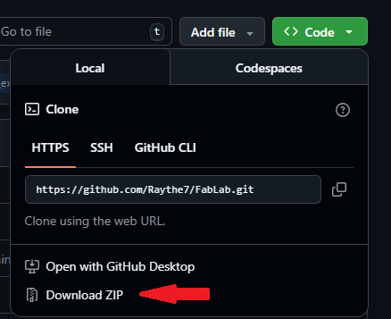
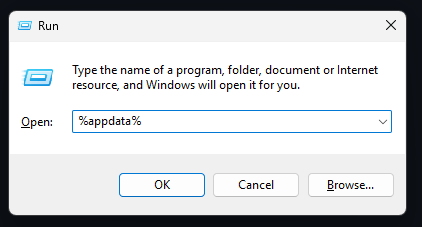
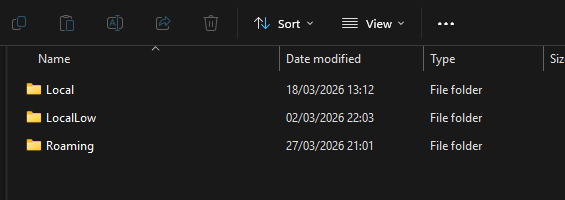
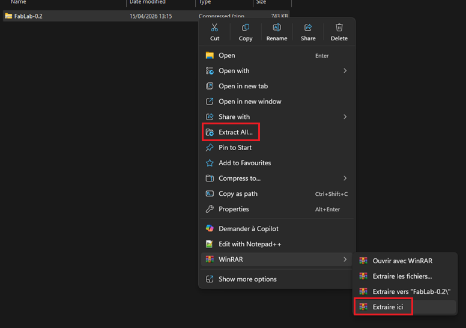

Temps de création d'un dessin
=====

.. _Time:

Procédure
Pour commencer, créez ou importez votre dessin (esquisse).

Ensuite, sélectionnez votre dessin à l'aide de ``l'outil de sélection``.

Vous pouvez également effectuer cette sélection directement dans l'onglet ``Layers and objects``.

:alt: ZIP

Une fois la sélection effectuée, rendez-vous dans l'extension Dynalab et utilisez l'option ``3- Définir temps de création``.

:alt: appdata

Une fenêtre s'ouvre : vous y trouverez le type de mesure, l'unité et le matériau.

:alt: Roaming

Une fois que vous avez saisi les paramètres souhaités, il vous suffit d'appuyer sur le bouton Apply.

:alt: Roaming

Une fenêtre apparaîtra alors avec le temps estimé de votre dessin.

:alt: extract
