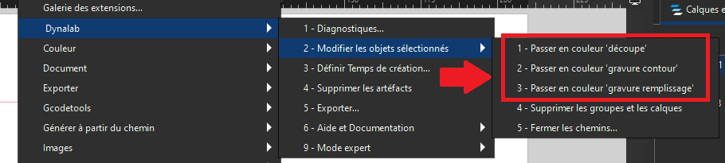

Norme de coloration d'un projet
=====

.. _couleurs:

Les machines du Dynalab ont besoin d'un code couleur pour pouvoir effectuer les actions voulues (ex : découper, graver, ...).
Pour cela nous devons dans nos dessins ajouter ces couleurs nous-mêmes, et voici comment faire.

Pour commencer, sélectionnez votre dessin à l'aide de ``l'outil de sélection``.

Vous pouvez également effectuer cette sélection directement dans l'onglet ``Layers and objects``.

.. image:: image_tuto/temps_selection.png

Une fois la sélection effectuée, rendez-vous dans l'extension Dynalab et utilisez l'option ``2 - Modifier les objets sélectionnés``.

Puis sélectionner la couleur voulue pour avoir le rendu souhaité.

La couleur 'découpe' sera rouge :

.. image:: image_tuto/couleur_decoupe.png

La couleur 'gravure contour' sera noire :

.. image:: image_tuto/couleur_gravure_contour.png

La couleur 'gravure remplissage' sera bleue :

.. image:: image_tuto/couleur_gravure_remplissage.png

