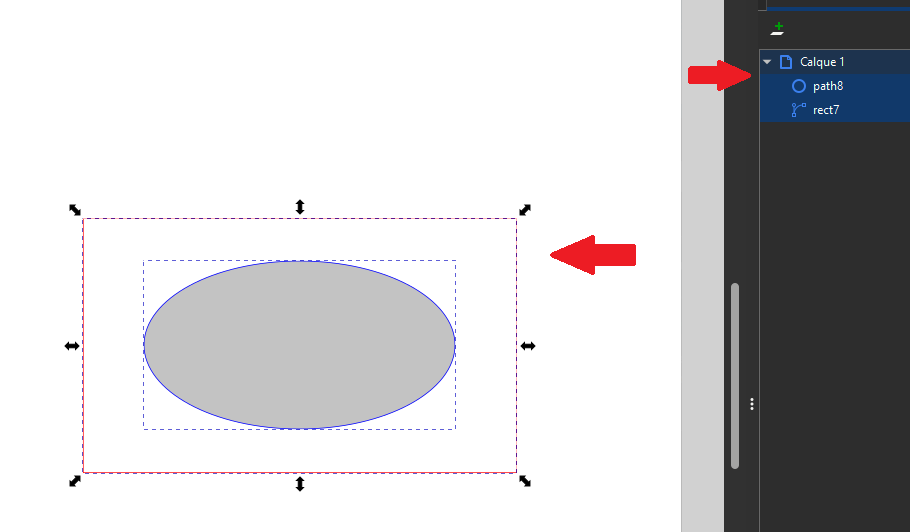
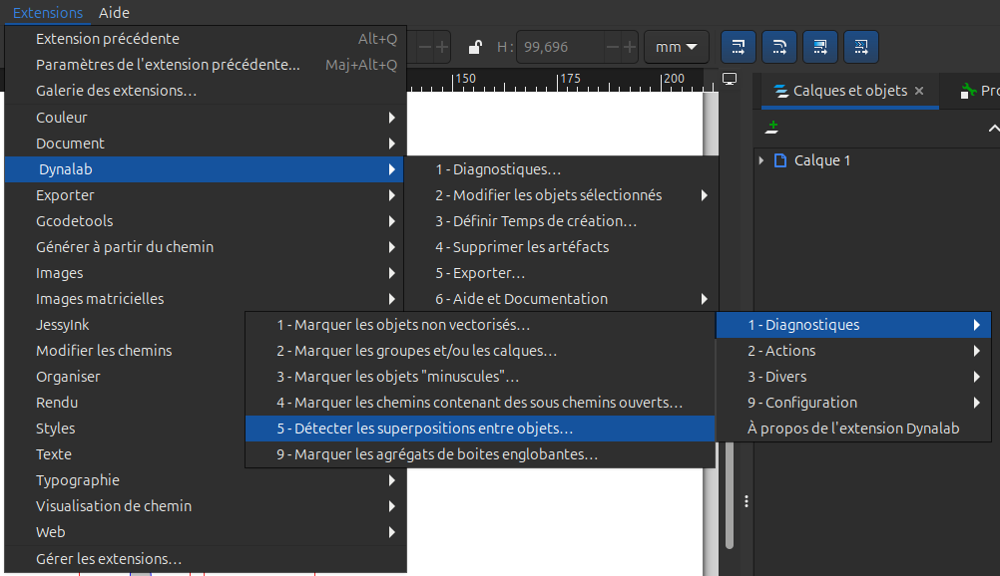
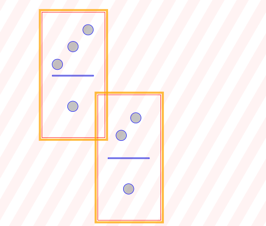

Détecter les intersections et superpositions
=====

Lorsque l'on veut usiner notre projet, il faut faire attention à ce qu'il n'y ai pas de superposition ni d'intersection
au risque de ne pas avoir le résultat voulu, voire pire provoquer un incident.

Pour commencer, vous pouvez selectionnez précisément la zone à diagnostiquer avec votre souris ou dans la barre prévu à cet effet.
Dans le cas contraire, c'est tout votre dessin qui sera analysé.

Une fois séléctionné, dans la barre d'outils, allez dans l'onglet Extensions -> Dynalab -> 9 - Mode Expert -> 1 - Diagnostiques -> 5 - Détecter les superpositions entre objets

Dans le menu, choisissez de restreindre ou non aux objets de couleurs gravure remplissage, puis lancez.

Si tout c'est bien passez, vous devriez avoir un rendu similaire à ceci:

``Supported shapes found: 11
1 intersecting pair found``

Les objets ayant une intersection ou une superposition seront encadré en orange.

Attention, si l'analyse est trop longue, elle s'arrêtera mais affichera quand même les intersections et superpositions détecté.

