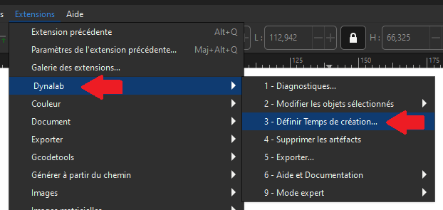
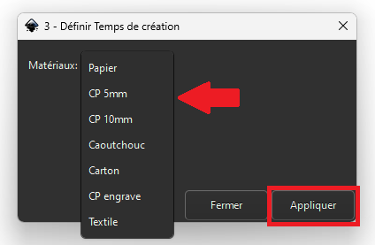
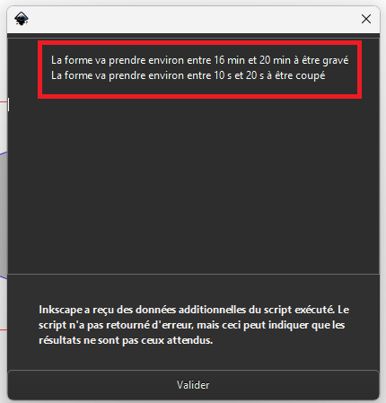

Temps de création d'un dessin
=====

.. _time:

Prérequis : avoir un dessin avec les couleurs :ref:`couleurs`.

Pour commencer, sélectionnez votre dessin à l'aide de ``l'outil de sélection``.

Vous pouvez également effectuer cette sélection directement dans l'onglet ``Layers and objects``.

.. image:: image_tuto/temps_selection.png

Une fois la sélection effectuée, rendez-vous dans l'extension Dynalab et utilisez l'option ``3- Définir temps de création``.

Une fenêtre s'ouvre : vous y trouverez la liste des matériaux utilisables.
Une fois que vous avez saisi le paramètre souhaité, il vous suffit d'appuyer sur le bouton ``appliquer``.

Une fenêtre apparaîtra alors avec les temps moyens estimés de votre dessin, pour la gravure et la découpe.

