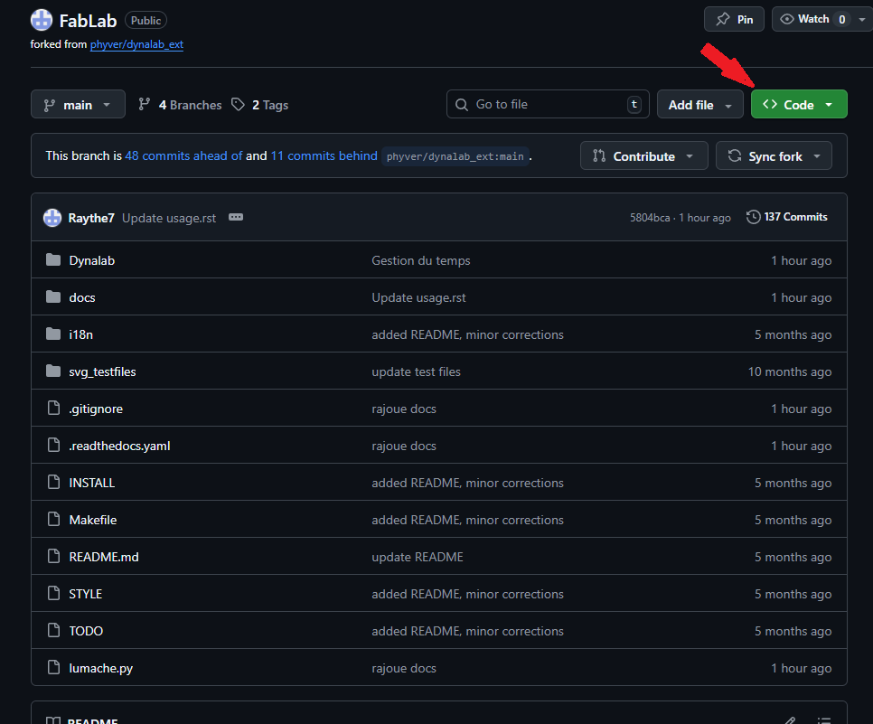
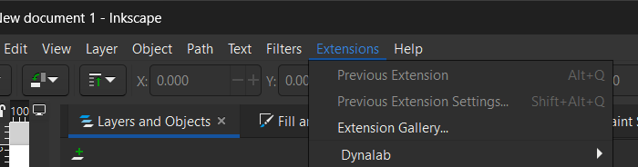
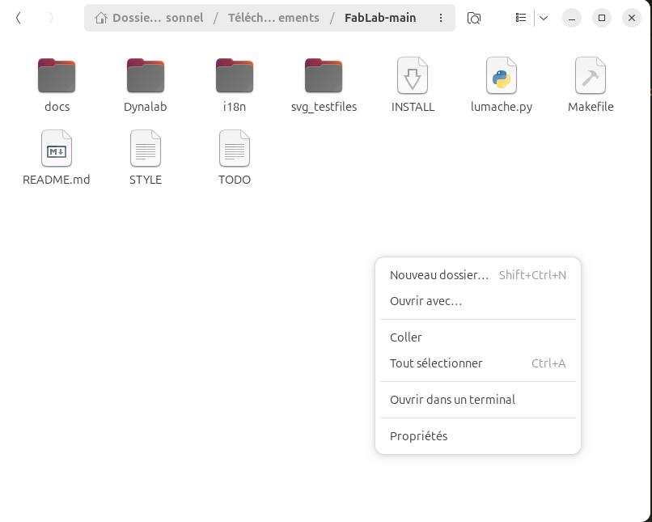

Installation
=====

.. _installation:

Lien Github
------------

Pour commencer rendez vous sur ce lien github : https://github.com/Raythe7/FabLab/

Installation du fichier de l'extention
----------------
Une fois sur la page GitHub, appuyez sur le bouton vert "Code".

Cliquez ensuite sur ``"Download ZIP"`` pour télécharger l'archive.

.. image:: image_tuto/ZIP.png
   :alt: ZIP

Une fois le fichier téléchargé, utilisez le raccourci ``Windows + R`` sur votre clavier.

Dans la fenêtre qui s'ouvre, tapez ``%appdata%`` et validez par Entrée.

.. image:: image_tuto/appdata.png
   :alt: appdata

L'explorateur de fichiers s'ouvre : ouvrer le dossier ``Romaing`` et cherchez puis ouvrez le dossier nommé ``Inkscape``.

.. image:: image_tuto/Roaming.png
   :alt: Roaming

À l'intérieur, localisez le dossier ``"extensions"``.

Déplacez le fichier ZIP téléchargé dans ce dossier extensions.

Une fois déplacer faites un clic droit sur le fichier ZIP et choisissez ``"Extraire ici"`` (ou ``"Extraire tout"``) pour le décompresser.

.. image:: image_tuto/extract.png
   :alt: extract

Une fois les fichiers extraits, vous pouvez lancer le logiciel Inkscape pour profiter de votre nouvelle extension.

SOUS LINUX( Ubuntu )
----------

Une fois sur la page GitHub, appuyez sur le bouton vert "Code".

:alt: Mon code vert

Cliquez ensuite sur ``"Download ZIP"`` pour télécharger l'archive.

.. image:: image_tuto/ZIP.png
:alt: ZIP

Rendez-vous ensuite dans le fichier FabLab-main 
puis ouvrez un terminal.

:alt: dossierLinux

Dans ce terminal, exécutez cette ligne de code:
``make LANG=fr very-clean install``
OU
``make LANG=en very-clean install``

Vous pouvez maintenant profiter de l'extension. 